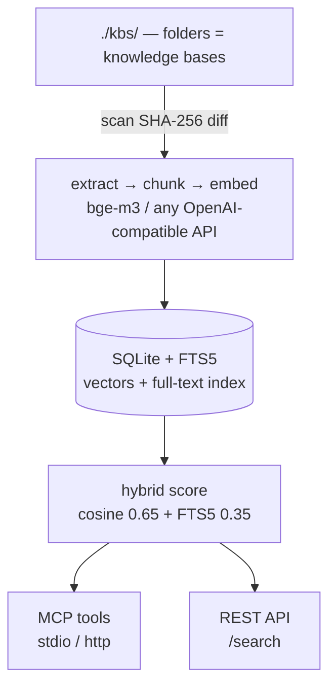

# rag-hub-mcp

**Self-hosted RAG that speaks MCP. Drop folders, get a knowledge base. Zero infrastructure.**

Drop documents into folders → each folder becomes a named knowledge base → search them from any MCP-compatible agent (Claude Code, OpenCode, Cline…) or over a tiny REST API. Your data stays on your machine — there's no vector database to run.

[](https://github.com/openhoat/rag-hub-mcp/actions/workflows/ci.yml)
[](LICENSE)
[](https://www.npmjs.com/package/rag-hub-mcp)
[](https://www.typescriptlang.org)
[](https://github.com/openhoat/rag-hub-mcp)
[](https://github.com/openhoat/rag-hub-mcp)

> **Full documentation:** [openhoat.github.io/rag-hub-mcp](https://openhoat.github.io/rag-hub-mcp)

## Why rag-hub-mcp?

Most RAG setups need a vector database, a chunking pipeline, an embeddings service and glue code. `rag-hub-mcp` collapses all of that into one process:

- **Folders are knowledge bases** — a 1st-level folder is a KB, named after the folder. No schema, no UI.
- **Zero infrastructure** — one SQLite database with FTS5. No vector DB, no server to keep running.
- **MCP-native** — 8 tools over the Model Context Protocol, so any agent can use it in seconds.
- **Hybrid search** — vector cosine similarity fused with SQLite FTS5 keyword search.

## How it works



## Install

No install needed — run it directly with `npx`:

```bash
# stdio mode (default): serve MCP tools for a local agent
npx rag-hub-mcp

# HTTP mode: REST API + MCP (streamable-http) on a port
npx rag-hub-mcp --http
```

Requires **Node 22+**. `better-sqlite3` compiles natively on first use (prebuilt binaries are used when available).

## Quick start

```bash
mkdir -p ./kbs/my-knowledge-base
echo "Hello RAG" > ./kbs/my-knowledge-base/hello.md
npx rag-hub-mcp
```

Any MCP-compatible agent can launch the server itself via `npx` — no server to keep running:

```json
{
  "mcpServers": {
    "rag-hub-mcp": {
      "command": "npx",
      "args": ["rag-hub-mcp"],
      "env": {
        "EMBEDDINGS_BASE_URL": "http://localhost:11434/v1",
        "EMBEDDINGS_MODEL": "bge-m3",
        "KB_ROOT": "./kbs",
        "DB_PATH": "./rag.db"
      }
    }
  }
}
```

The 8 `rag_*` tools are then available in your agent sessions.

### HTTP server / Docker

For a shared server over the network or a Docker deployment, see [getting started](https://openhoat.github.io/rag-hub-mcp/guide/getting-started). In short:

```bash
MCP_API_KEY=my-secret-key EMBEDDINGS_BASE_URL=http://localhost:11434/v1 \
  KB_ROOT=./kbs npx rag-hub-mcp --http

docker run -p 8000:8000 -e MCP_API_KEY=my-secret-key \
  -e EMBEDDINGS_BASE_URL=http://host.docker.internal:11434/v1 ghcr.io/openhoat/rag-hub-mcp:latest
```

## MCP tools & REST API

8 tools over MCP (`rag_list_kbs`, `rag_search`, `rag_add_document`, …) and a small `/search` + `/admin/*` REST API. See the [MCP tools](https://openhoat.github.io/rag-hub-mcp/guide/mcp-tools) and [REST API](https://openhoat.github.io/rag-hub-mcp/guide/rest-api) docs for the full detail.

## Configuration

Set via environment variables (`MCP_API_KEY`, `EMBEDDINGS_BASE_URL`, `EMBEDDINGS_MODEL`, `KB_ROOT`, `DB_PATH`, …). See the [configuration](https://openhoat.github.io/rag-hub-mcp/guide/configuration) docs for the full table.

## Roadmap

- Streaming search results over MCP
- Web UI dashboard (stats, documents, live search)
- Pluggable vector backends (pgvector, Qdrant)
- Multi-tenant / shared deployments
- Reranking of hybrid results

## Documentation

The full docs live at **[openhoat.github.io/rag-hub-mcp](https://openhoat.github.io/rag-hub-mcp)** — [getting started](https://openhoat.github.io/rag-hub-mcp/guide/getting-started), [architecture](https://openhoat.github.io/rag-hub-mcp/guide/architecture), [MCP tools](https://openhoat.github.io/rag-hub-mcp/guide/mcp-tools), [REST API](https://openhoat.github.io/rag-hub-mcp/guide/rest-api), [integrations](https://openhoat.github.io/rag-hub-mcp/guide/integrations), and an [end-to-end example](https://openhoat.github.io/rag-hub-mcp/guide/end-to-end).

## Development

```bash
npm install
npm run validate    # lint + typecheck + test + build
npm start           # start the server
```

Uses **Biome** for linting/formatting and **vitest** for unit tests. Contributions are welcome.

## License

MIT
