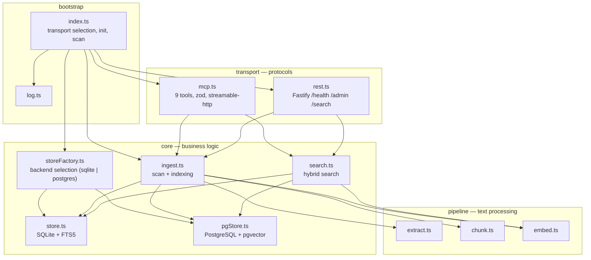
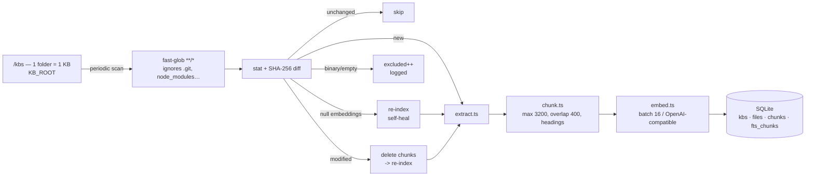

# Architecture

`rag-hub-mcp` is a single process: it watches a root folder, ingests documents into a local index (SQLite by default), and exposes them via MCP and REST. Two storage backends implement the same `Store` interface — SQLite/FTS5 (default, self-contained) and PostgreSQL + pgvector (opt-in).

## Layer view

Source code (`src/`) is organized into four layers, with dependencies pointing downward:



`types.ts` is the shared kernel: the `Store`, `ChunkRecord`, `KbInfo`, `DocInfo` interfaces, etc., are imported by every layer. `testing/helpers.ts` groups test utilities (stub store, mock embeddings, HTTP server).

## Indexing flow



- The `KB_ROOT` folder is scanned at startup, then periodically (`SCAN_INTERVAL`, HTTP mode only).
- Top-level subfolders are KBs, named after the folder.
- Each file is hashed (SHA-256): only new or modified files are re-encoded.
- Deleted files and orphaned KBs are purged from the index (`cleanupStale`).

### Skip / modify / add decision

`scanKb` compares each file against what is stored in the database:

| Case | Condition | Action |
| --- | --- | --- |
| unchanged | same `mtime` + same size | `skipped++` |
| same content | same SHA-256 (mtime changed) | update `mtime` only, `skipped++` |
| modified | different SHA-256 | purge chunks, re-index, `modified++` |
| new | absent from database | purge any stale file, index, `added++` |
| binary/empty | no extractable text | `excluded++`, logged (`warn`) |
| null embeddings | chunks with `embedding IS NULL` | re-index even if unchanged, `modified++` |

## SQLite schema

Four tables, two relationships via the `ON DELETE CASCADE` constraint, virtual FTS5 index.

```sql
kbs        (id PK, name UNIQUE)
files      (id PK, kb_id FK→kbs ON DELETE CASCADE, rel_path, sha256,
            mtime, bytes, UNIQUE(kb_id, rel_path))
chunks     (id PK, file_id FK→files ON DELETE CASCADE, chunk_index,
            content, metadata JSON, embedding BLOB, UNIQUE(file_id, chunk_index))
fts_chunks (VIRTUAL fts5: content, metadata UNINDEXED, tokenize='porter unicode61')
```

**Important FTS5 trick**: `insertChunk` writes `fts_chunks (rowid, content, metadata)` with `rowid == chunks.id`. This coupling aligns the virtual rows on those of `chunks`, which makes purge and deletion (delete, purgeKB, cleanup) idempotent — no more FTS5 orphans. Deletion goes through `DELETE FROM fts_chunks WHERE rowid = ?` before each chunk deletion.

## Pluggable backends

`storeFactory.ts` selects the backend according to `STORE_BACKEND`. The rest of the
code only sees the `Store` interface:

```text
ingest.ts / search.ts / transport/        ↓
    Store interface (18 async methods)
        ↓
    storeFactory.ts → STORE_BACKEND=sqlite   → store.ts    (better-sqlite3 + FTS5)
                    → STORE_BACKEND=postgres → pgStore.ts  (pg + pgvector)
```

### PostgreSQL + pgvector

- Schema identical in names/columns to SQLite. Two differences:
  - `embedding` is a `vector(N)` column (sized via `EMBEDDINGS_DIMENSION`)
    instead of a BLOB. Conversion happens at the boundary in `Buffer` Float32, transparent
    for the rest of the code.
  - FTS through a generated `tsv tsvector` column + GIN index, ranked via
    `ts_rank()` / `to_tsquery()` instead of FTS5.
- The migration is idempotent (`CREATE EXTENSION IF NOT EXISTS vector`,
  `CREATE TABLE IF NOT EXISTS`) and runs on first connection.
- Hybrid search: for Phase 2, `getAllChunks()` + JS cosine is
  kept (same behavior as SQLite). Native pgvector vector search
  (`<=>`, `LIMIT k`) is a possible future optimization.
- The `searchFts(words: string[])` signature abstracts the full-text syntax:
  each backend builds its native query (`"w1" AND "w2"` FTS5 vs
  `to_tsquery('w1 & w2')`).
- Tests: `src/test/e2e/pgstore.e2e.test.ts` against a real Postgres engine compiled
  in WASM (**PGlite** + pgvector extension), instantiated in memory for the duration
  of the tests — no server, no docker, separate from the production database.

## Hybrid search

```mermaid
graph LR
    Q["query"] --> EMBQ["embedTexts([query])"]
    Q --> FTS["buildFtsScores<br/>MATCH \"w1\" AND \"w2\""]
    EMBQ --> VEC["cosine(query, chunk)<br/>threshold 0.08"]
    FTS --> KW["rank → 1/(1+|rank|)"]
    VEC --> SCORE[("0.65 · vec + 0.35 · kw")]
    KW --> SCORE
    SCORE --> TOP["topK by score<br/>content truncated to 1000"]
```

- **Vector**: cosine similarity between the query embedding and each chunk, weighted 0.65, minimum threshold 0.08.
- **Keyword**: FTS5 scores weighted 0.35. The MATCH query is built as `'"word1" AND "word2"'` over words longer than 2 characters.
- **Fallback**: if embedding fails or FTS5 is unavailable, it falls back to a per-word `indexOf` match.
- The KB filter is applied via `getAllChunks(kb)`; the merged score sorts and returns the `topK` results with their citations (`kb`, `relPath`, `chunkIndex`).

## Transport models

| | stdio (default) | HTTP (`--http`) |
| --- | --- | --- |
| Connection | `StdioServerTransport` over stdin/stdout | `StreamableHTTPServerTransport` (streamable-http) |
| Scan | initial one-shot | initial + periodic (`SCAN_INTERVAL`) |
| MCP sessions | one, unique | one per client: `Map<sessionId, {server, transport}>` |
| REST | no | yes (`/health`, `/admin/*`, `/search`) |
| Logs | → stderr (stdout = JSON-RPC) | → stdout |

In HTTP, each MCP client gets **its own** `McpServer` + `StreamableHTTPServerTransport` pair, identified by a `Mcp-Session-Id` (UUID). A POST `/mcp` without a session creates a dedicated transport; subsequent calls reuse this transport via the session header. This avoids the *"Server already initialized"* error on concurrent clients. `GET /mcp` exposes the list of the 9 tools (useful for the MCP inspector).

The MCP SDK receives Fastify's native Node objects `IncomingMessage`/`ServerResponse`: `transport.handleRequest(request.raw, reply.raw, request.body)`. In Fastify, `reply.hijack()` is used to take back control of the raw response before passing `reply.raw` to the SDK: `reply.hijack()` transfers the response lifecycle to the caller, and the SDK writes directly (SSE + JSON-RPC) on the raw Node response.

## Configuration resolution

The import order in `index.ts` is critical:

1. `config.ts` parses the environment on import (Zod schema, fail-fast) and computes the `KB_ROOT` / `DB_PATH` defaults according to the transport (cwd-relative in stdio, container paths in HTTP).
2. `ingest.ts` reads `KB_ROOT` on module load; since `config.ts` is imported before it, the value is already pinned.

In stdio mode, defaults are relative to the cwd (`./kbs`, `./rag.db`); in HTTP mode the container paths are kept (`/data/kbs`, `/data/index/rag.db`).

## Testing

- **Unit** (`src/**/*.unit.test.ts`): pure and fast, mocked dependencies. The `/embeddings` endpoint is mocked via `stubEmbeddingsApi` (intercepts global `fetch` for this single path).
- **E2E** (`src/test/e2e/**/*.e2e.test.ts`): real disk + SQLite + HTTP.
- `KB_ROOT` trap: `ingest.ts` reads `KB_ROOT` on module load → `vitest.setup.ts` pins it to a shared tmpdir. Tests that drop files write into this `KB_ROOT` with unique KB names.
