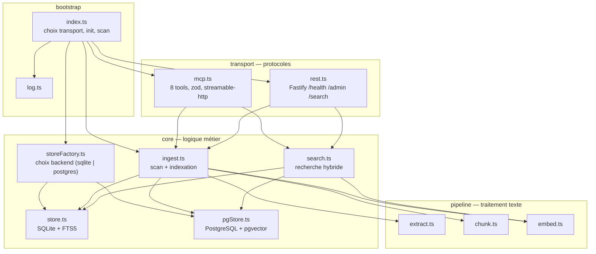
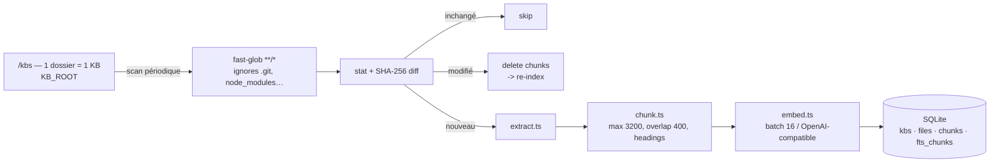

# Architecture

`rag-hub-mcp` est un process unique : il surveille un dossier racine, ingère les documents dans un index local (SQLite par défaut), et les expose via MCP et REST. Deux backends de stockage implémentent la même interface `Store` — SQLite/FTS5 (par défaut, autonome) et PostgreSQL + pgvector (opt-in).

## Vue en couches

Le code source (`src/`) est organisé en quatre couches, dépendances pointées vers le bas :



`types.ts` est le noyau partagé : les interfaces `Store`, `ChunkRecord`, `KbInfo`, `DocInfo`, etc. sont importées par toutes les couches. `testing/helpers.ts` regroupe les utilitaires de test (stub store, mock embeddings, serveur HTTP).

## Flux d'indexation



- La racine `KB_ROOT` est scannée au démarrage puis périodiquement (`SCAN_INTERVAL`, mode HTTP uniquement).
- Les sous-dossiers de premier niveau sont des KB, nommés d'après le dossier.
- Chaque fichier est haché (SHA-256) : seuls les fichiers nouveaux ou modifiés sont ré-encodés.
- Les fichiers supprimés et les KB orphelines sont purgés de l'index (`cleanupStale`).

### Décision skip / modify / add

`scanKb` compare chaque fichier à ce qu'il a en base :

| Cas | Condition | Action |
|---|---|---|
| inchangé | même `mtime` + même taille | `skipped++` |
| même contenu | même SHA-256 (mtime changé) | met à jour `mtime` seul, `skipped++` |
| modifié | SHA-256 différent | purge chunks, re-index, `modified++` |
| nouveau | absent en base | purge fichier stale éventuel, indexe, `added++` |

## Schéma SQLite

Quatre tables, deux relations par contrainte `ON DELETE CASCADE`, index FTS5 virtuel.

```sql
kbs        (id PK, name UNIQUE)
files      (id PK, kb_id FK→kbs ON DELETE CASCADE, rel_path, sha256,
            mtime, bytes, UNIQUE(kb_id, rel_path))
chunks     (id PK, file_id FK→files ON DELETE CASCADE, chunk_index,
            content, metadata JSON, embedding BLOB, UNIQUE(file_id, chunk_index))
fts_chunks (VIRTUAL fts5: content, metadata UNINDEXED, tokenize='porter unicode61')
```

**Astuce FTS5 (importante)** : `insertChunk` écrit `fts_chunks (rowid, content, metadata)` avec `rowid == chunks.id`. Ce couplage aligne les rangées virtuelles sur celles de `chunks`, ce qui rend la purge supprimer (delete, purgeKB, cleanup) idempotente — plus d'orphelins FTS5. La suppression passe par `DELETE FROM fts_chunks WHERE rowid = ?` avant chaque suppression de chunk.

## Backends pluggables

`storeFactory.ts` sélectionne le backend selon `STORE_BACKEND`. Le reste du
code ne voit que l'interface `Store` :

```
ingest.ts / search.ts / transport/
        ↓
    Store interface (18 méthodes async)
        ↓
    storeFactory.ts → STORE_BACKEND=sqlite   → store.ts    (better-sqlite3 + FTS5)
                    → STORE_BACKEND=postgres → pgStore.ts  (pg + pgvector)
```

### PostgreSQL + pgvector

- Schéma identique en noms/colonnes à SQLite. Deux différences :
  - `embedding` est une colonne `vector(N)` (sizing via `EMBEDDINGS_DIMENSION`)
    au lieu d'un BLOB. Conversion à la frontière en `Buffer` Float32, transparente
    pour le reste du code.
  - FTS via une colonne générée `tsv tsvector` + index GIN, classée par
    `ts_rank()` / `to_tsquery()` au lieu de FTS5.
- La migration est idempotente (`CREATE EXTENSION IF NOT EXISTS vector`,
  `CREATE TABLE IF NOT EXISTS`) et s'exécute à la première connexion.
- Recherche hybride : pour la Phase 2, `getAllChunks()` + cosine en JS est
  conservé (même comportement que SQLite). La recherche vectorielle native
  pgvector (`<=>`, `LIMIT k`) est une optimisation future possible.
- La signature `searchFts(words: string[])` abstrait la syntaxe full-text :
  chaque backend construit sa requête native (`"w1" AND "w2"` FTS5 vs
  `to_tsquery('w1 & w2')`).
- Tests : `src/e2e/pgstore.e2e.test.ts` contre un véritable moteur Postgres compilé
  en WASM (**PGlite** + extension pgvector), instancié en mémoire pour la durée
  des tests — aucun serveur, aucun docker, distinct de la base de production.

## Recherche hybride

```mermaid
graph LR
    Q["query"] --> EMBQ["embedTexts([query])"]
    Q --> FTS["buildFtsScores<br/>MATCH \"w1\" AND \"w2\""]
    EMBQ --> VEC["cosine(query, chunk)<br/>threshold 0.08"]
    FTS --> KW["rank → 1/(1+|rank|)"]
    VEC --> SCORE[("0.65 · vec + 0.35 · kw")]
    KW --> SCORE
    SCORE --> TOP["topK par score<br/>content tronqué à 1000"]
```

- **Vector** : similarité cosinus entre l'embedding de la requête et chaque chunk, pondérée 0.65, seuil minimal 0.08.
- **Keyword** : scores FTS5 pondérés 0.35. La requête MATCH est construite en `'"word1" AND "word2"'` sur les mots de plus de 2 caractères.
- **Fallback** : si l'embedding échoue ou FTS5 est indisponible, on retombe sur une correspondance `indexOf` par mot.
- Le filtre KB est appliqué via `getAllChunks(kb)` ; le score fusionné trie et retourne les `topK` résultats avec leurs citations (`kb`, `relPath`, `chunkIndex`).

## Modèles de transport

| | stdio (défaut) | HTTP (`--http`) |
|---|---|---|
| Connexion | `StdioServerTransport` sur stdin/stdout | `StreamableHTTPServerTransport` (streamable-http) |
| Scan | initial one-shot | initial + périodique (`SCAN_INTERVAL`) |
| Sessions MCP | une, unique | une par client : `Map<sessionId, {server, transport}>` |
| REST | non | oui (`/health`, `/admin/*`, `/search`) |
| Logs | → stderr (stdout = JSON-RPC) | → stdout |

En HTTP, chaque client MCP reçoit **sa propre paire** `McpServer` + `StreamableHTTPServerTransport`, identifiée par un `Mcp-Session-Id` (UUID). Un POST `/mcp` sans session crée un transport dédié ; les appels suivants réutilisent ce transport via l'en-tête de session. Ceci évite l'erreur *« Server already initialized »* sur les clients concurrents. `GET /mcp` expose la liste des 8 tools (utile pour l'inspecteur MCP).

Le SDK MCP reçoit les objets Node natifs `IncomingMessage`/`ServerResponse` de Fastify : `transport.handleRequest(request.raw, reply.raw, request.body)`. En Fastify, on utilise `reply.hijack()` pour reprendre la main sur la réponse brute avant de passer `reply.raw` au SDK : `reply.hijack()` transfère le cycle de vie de la réponse à l'appelant, et le SDK écrit directement (SSE + JSON-RPC) sur la réponse Node brute.

## Résolution de configuration

L'ordre d'import dans `index.ts` est critique :

1. `config.ts` parse l'environnement à l'import (schéma Zod, fail-fast) et calcule les défauts `KB_ROOT` / `DB_PATH` selon le transport (cwd relatif en stdio, chemins conteneur en HTTP).
2. `ingest.ts` lit `KB_ROOT` au chargement du module ; comme `config.ts` est importé avant lui, la valeur est déjà figée.

En mode stdio, les défauts sont relatifs au cwd (`./kbs`, `./rag.db`) ; en mode HTTP on garde les chemins conteneur (`/data/kbs`, `/data/index/rag.db`).

## Testing

- **Unit** (`src/**/*.unit.test.ts`) : pur et rapide, dépendances mockées. L'endpoint `/embeddings` est mocké via `stubEmbeddingsApi` (intercepte `fetch` global pour ce seul chemin).
- **E2E** (`src/e2e/**/*.e2e.test.ts`) : vrai disque + SQLite + HTTP.
- Piège `KB_ROOT` : `ingest.ts` lit `KB_ROOT` au chargement du module → `vitest.setup.ts` le fixe sur un tmpdir partagé. Les tests qui déposent des fichiers écrivent dans ce `KB_ROOT` avec des noms de KB uniques.
