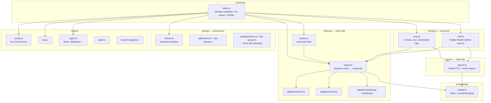
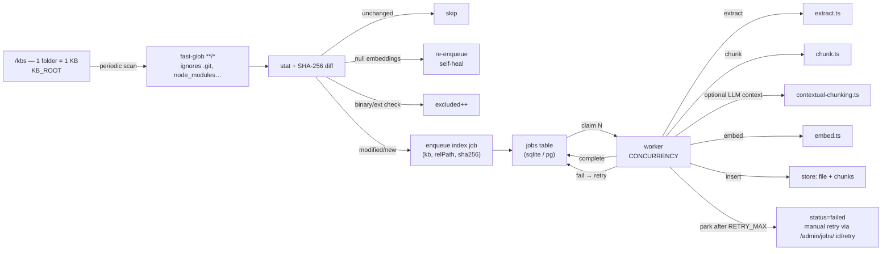

# Architecture

`rag-hub-mcp` is a single process: it watches a root folder and exposes documents via MCP and REST. Indexing is asynchronous: a producer scans the filesystem and enqueues jobs; a background worker extracts, chunks, embeds, and inserts them. Two storage backends implement the same `Store` interface — SQLite/FTS5 (default, self-contained) and PostgreSQL + pgvector (opt-in).

## Layer view

Source code (`src/`) is organized into domains with strict dependency rules enforced by **dependency-cruiser** (`qa:arch` gate):



`shared/types.ts` is the contract kernel: `Store`, `JobQueue`, `ChunkRecord`, … — imported by every other domain. `test/helpers.ts` groups test utilities (stubs, mock embeddings, HTTP server).

## Indexing flow



The producer (`ingest.ts:scanAll`) only handles the **cheap** part: filesystem scan, hash, unchanged detection. The **expensive** part (extraction, chunking, embedding, DB writes) runs in the worker.

### Skip / modify / add decision

For each file the producer checks:

1. **mtime + bytes unchanged** → skip (no job enqueued)
2. **SHA-256 unchanged** → update mtime only, skip
3. **Null embeddings exist** → delete old chunks, re-enqueue index job
4. **Binary or empty file** (extension check + head sniff) → excluded, not enqueued
5. **Modified or new** → delete old chunks (if any), enqueue index job

## SQLite schema

```sql
CREATE TABLE kbs    (id INTEGER PRIMARY KEY, name TEXT UNIQUE);
CREATE TABLE files  (id INTEGER PRIMARY KEY, kb_id INTEGER REFERENCES kbs, rel_path TEXT,
                     sha256 TEXT, mtime INTEGER, bytes INTEGER,
                     UNIQUE(kb_id, rel_path));
CREATE TABLE chunks (id INTEGER PRIMARY KEY, file_id INTEGER REFERENCES files,
                     chunk_index INTEGER, content TEXT, metadata TEXT, embedding BLOB,
                     UNIQUE(file_id, chunk_index));
CREATE VIRTUAL TABLE fts_chunks USING fts5(content, metadata UNINDEXED, tokenize='porter unicode61');

-- Jobs table (created by the queue, same DB file in sqlite mode)
CREATE TABLE jobs   (id INTEGER PRIMARY KEY, kb TEXT, rel_path TEXT, op TEXT, sha256 TEXT,
                     mtime INTEGER, bytes INTEGER, status TEXT, attempts INTEGER, last_error TEXT,
                     started_at INTEGER, created_at INTEGER,
                     UNIQUE(kb, rel_path, op));
```

The `jobs` table lives in the same database file (for SQLite) or the same PostgreSQL database (for the pg backend). Each queue backend creates it with `CREATE TABLE IF NOT EXISTS` on first connect.

## Pluggable backends

Both the **store** and the **queue** follow the same pattern: an abstract interface, a concrete implementation per backend, and a factory that reads `STORE_BACKEND`:

```text
storage/factory.ts → STORE_BACKEND=sqlite   → storage/sqlite/store.ts     (better-sqlite3 + FTS5)
                   → STORE_BACKEND=postgres → storage/postgres/store.ts   (pg + pgvector)
                                              storage/postgres/db.ts       (Db interface, poolToDb)

                   → STORE_BACKEND=sqlite   → storage/sqlite/job-queue.ts
                   → STORE_BACKEND=postgres → storage/postgres/job-queue.ts (FOR UPDATE SKIP LOCKED)
```

The `Db` interface in `storage/postgres/db.ts` abstracts the driver (`pg.Pool` in production, in-memory PGlite in tests) so PostgreSQL connectors can be unit-tested without a real server.

### PostgreSQL + pgvector

See [storage backends](./configuration#storage-backends) for setup.

The PostgreSQL queue uses `FOR UPDATE SKIP LOCKED` for atomic job claiming, parallel-safe across multiple workers (future use).

## Hybrid search

Each search query is executed as two parallel queries and fused with weighted scoring:

- **Vector search**: cosine similarity against the query embedding — returns chunks with a similarity score.
- **Full-text search**: keyword match via FTS5 (SQLite) or `ts_rank` (PostgreSQL) — returns chunks with a relevance score.

Both scores are normalized to `[0, 1]` and fused by the hybrid search formula (weighted sum). The top-K results are returned.

## Transport models

- **stdio** (default): MCP server on stdin/stdout. No periodic scan, no REST. Single client.
- **http** (`--http` / `RAG_TRANSPORT=http`): Fastify server serving REST + streamable-http MCP on `PORT`. Periodic scan loop, rate-limited session creation, idle TTL eviction.

## Configuration resolution

1. `config.ts` runs `EnvSchema.parse(process.env)` at module load — all env vars are validated **fail-fast** before any business logic runs.
2. `ingest.ts` reads `KB_ROOT` on module load; since `config.ts` is imported before it, the value is already pinned.
3. `index.ts` creates the store, the job queue, and the worker, then starts the appropriate transport.

## Testing

- **Unit tests** (`*.unit.test.ts`) run in the `unit` vitest project. They use `makeStubStore()` / `makeStubQueue()` and mocks for embeddings and extraction.
- **E2E tests** (`src/test/e2e/*.e2e.test.ts`) run in the `e2e` vitest project (thread pool, single worker, shared native SQLite addon). They create real SQLite stores, a `createSyncTestQueue` (synchronous jobs, no background worker needed), and a real HTTP server.
- **Postgres tests** use PGlite (Postgres WASM + pgvector) — no Docker or server required.
- **`KB_ROOT` trap**: `ingest.ts` reads `KB_ROOT` on module load → `vitest.setup.ts` pins it to a shared tmpdir. Tests that drop files write into this `KB_ROOT` with unique KB names.
