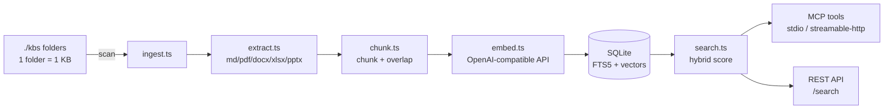

# Architecture

`rag-hub-mcp` is a single process: it watches a root folder, ingests documents into a SQLite database, and serves them through MCP and REST. There is no separate vector database — the index lives in one SQLite file with FTS5.

## Data flow

## Components

| Module | Role |
|---|---|
| `index.ts` | Bootstrap: create store, initial + periodic scan, mount REST + MCP. One MCP session per client. |
| `mcp.ts` | MCP server (`McpServer` + `registerTool`), 8 tools, zod schemas. |
| `rest.ts` | Express app: `/health`, `/admin/*`, `/search`. Bearer auth. |
| `store.ts` | SQLite schema: `kbs`, `files`, `chunks`, `fts_chunks` (WAL). |
| `ingest.ts` | Scan folders, extract text, chunk, embed, incremental re-index with SHA-256 diff. |
| `search.ts` | Hybrid search: vector cosine (0.65) + keyword FTS5 (0.35), per-chunk score. |
| `embed.ts` | `embedTexts` against an OpenAI-compatible `/embeddings` endpoint, cosine similarity. |
| `chunk.ts` | `chunkText` (max 3200, overlap 400, heading path). |
| `extract.ts` | Text extraction for md/txt/html/code, PDF, DOCX, XLSX, PPTX. |
| `log.ts` / `types.ts` | Logging + shared interfaces. |

## Indexing

- The root folder (`KB_ROOT`) is scanned periodically (`SCAN_INTERVAL`, HTTP mode only).
- First-level folders are knowledge bases, named after the folder.
- Each file is hashed (SHA-256); only new or changed files are re-embedded.
- Deleted files are purged from the index (stale cleanup).

## Search

Hybrid scoring fuses:

- **Vector** similarity against the query embedding (weight 0.65).
- **Keyword** relevance from the SQLite FTS5 full-text index (weight 0.35).

Results are ranked by the fused score and returned with source citations.
